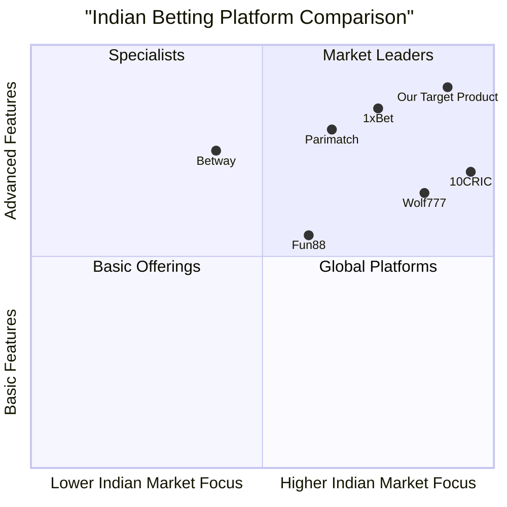

# Product Requirements Document: Wolf777 Clone Project

## 1. Executive Summary

This document outlines the requirements for developing a clone of the Wolf777 online betting platform with enhanced UI/UX, responsive design, and fully functional frontend/backend systems. The project aims to recreate Wolf777's core functionality while improving performance, security, and user experience using a modern technology stack including Angular 19, Node.js, MySQL, Redis, and Cloudinary.

The Wolf777 clone will cater primarily to the Indian market, offering sports betting (with a focus on cricket), casino games, and live betting options. The platform will be available on web and mobile interfaces, with a strong emphasis on responsive design, fast loading times, and secure payment processing for Indian users.

## 2. Website Analysis

### 2.1 Layout and Structure

Wolf777 features a user-friendly layout optimized for betting enthusiasts. While specific visual design elements couldn't be fully analyzed, the website follows common betting platform conventions with:

- **Header Section**: Contains logo, login/register buttons, and main navigation
- **Left Sidebar**: Lists sports categories and leagues
- **Main Content Area**: Displays featured matches, live events, and promotions
- **Right Sidebar**: Usually contains bet slip and promotional content
- **Footer**: Contains links to terms and conditions, responsible gambling, and support

### 2.2 Key Functionality

- **User Authentication**: Registration, login, profile management
- **Sports Betting**: Pre-match and live betting across multiple sports
- **Casino Gaming**: Slots, table games, live dealer options
- **Indian Specialty Games**: Teen Patti, Andar Bahar
- **Wallet Management**: Deposits, withdrawals, transaction history
- **Promotions System**: Welcome bonuses, ongoing promotions
- **Customer Support**: Live chat, email support

### 2.3 UX Patterns

- **Sports Navigation**: Hierarchical organization (Sport > League > Match)
- **Betting Interface**: Clear odds presentation with single-click bet selection
- **Bet Slip**: Persistent across site navigation, shows potential winnings
- **Live Betting**: Dynamic odds updates with minimal latency
- **Responsive Adaptation**: Layout adjusts for different screen sizes
- **Quick Access**: One-tap access to popular features (deposit, support)

## 3. User Personas and Journey Maps

### 3.1 Primary User Personas

#### 3.1.1 Casual Cricket Fan (Rahul, 28)
**Demographics:**
- Young professional from major Indian city
- Moderate tech literacy
- Monthly income: ₹40,000-₹60,000

**Behaviors:**
- Bets primarily during IPL and major cricket tournaments
- Places simple match-winner bets
- Uses platform 2-3 times per week during season
- Deposits ₹2,000-₹5,000 monthly during cricket season

**Pain Points:**
- Complex betting terminology
- Slow withdrawal process
- Confusion about bonus terms

#### 3.1.2 Serious Sports Bettor (Amit, 35)
**Demographics:**
- Mid-career professional
- High tech literacy
- Monthly income: ₹80,000+

**Behaviors:**
- Bets across multiple sports (cricket, football, tennis)
- Places complex bets (accumulators, handicaps)
- Uses platform daily
- Deposits ₹10,000+ monthly

**Pain Points:**
- Limited betting markets
- Odds not competitive enough
- Withdrawal limits

#### 3.1.3 Casino Player (Priya, 30)
**Demographics:**
- Urban professional
- Moderate tech literacy
- Monthly income: ₹50,000-₹70,000

**Behaviors:**
- Primarily plays slots and live casino
- Occasional sports betting
- Uses platform 3-4 times per week
- Deposits ₹5,000-₹8,000 monthly

**Pain Points:**
- Game loading times
- Limited game variety
- Complex verification process

### 3.2 User Journey Maps

#### 3.2.1 New User Registration and First Bet
1. **Discovery**: User finds platform through search/advertisement
2. **Registration**: Completes account creation form
3. **Verification**: Verifies email/phone number
4. **First Deposit**: Adds funds using preferred payment method
5. **Navigation**: Browses sports/games of interest
6. **Selection**: Chooses first bet/game
7. **Confirmation**: Places bet/starts game
8. **Result**: Receives outcome (win/loss)
9. **Continuation**: Explores other platform features

#### 3.2.2 Returning User Betting Flow
1. **Login**: User authenticates with credentials
2. **Check Balance**: Views current wallet amount
3. **Check Promotions**: Reviews available offers
4. **Navigation**: Goes to preferred betting section
5. **Selection**: Chooses events and odds
6. **Bet Placement**: Confirms wager amount and submits
7. **Tracking**: Monitors bet status or live action
8. **Result**: Receives outcome notification
9. **Cash Management**: Withdraws winnings or deposits more

## 4. Detailed Feature Requirements

### 4.1 User Account Management

#### 4.1.1 Registration (P0)
- **Must** support registration with email, phone number, and password
- **Must** implement age verification (18+)
- **Must** require acceptance of terms and conditions
- **Should** offer simplified registration with social accounts
- **Should** implement progressive profiling (collect minimal info initially)

#### 4.1.2 Login/Authentication (P0)
- **Must** support credential-based login (email/phone + password)
- **Must** implement multi-factor authentication for security
- **Must** provide password reset functionality
- **Should** support biometric login on mobile devices
- **Should** implement session timeouts for security

#### 4.1.3 Profile Management (P0)
- **Must** allow users to update personal information
- **Must** support KYC document upload and verification
- **Must** provide account limits setting (deposit, betting, time)
- **Should** display activity history and bet records
- **May** include personal preferences and settings

### 4.2 Sports Betting Features

#### 4.2.1 Sports Navigation (P0)
- **Must** organize sports hierarchically (sport > league > event)
- **Must** highlight popular and featured events
- **Must** provide search functionality for teams/events
- **Should** allow favorites/bookmarking
- **Should** display recently viewed events

#### 4.2.2 Betting Interface (P0)
- **Must** display clear odds in decimal, fractional, and Indo formats
- **Must** provide single-click bet selection
- **Must** calculate potential returns automatically
- **Must** support single and multiple (parlay) bets
- **Should** provide odds change indicators
- **May** offer bet builder functionality

#### 4.2.3 Cricket Betting Specialization (P0)
- **Must** offer extensive IPL coverage with specialized markets
- **Must** support popular cricket bet types (match winner, top batsman)
- **Must** provide detailed match statistics
- **Should** offer live ball-by-ball betting
- **Should** include tournament outright betting

#### 4.2.4 Live Betting (P1)
- **Must** display real-time odds updates
- **Must** provide match status information
- **Should** include basic visualization of match events
- **Should** offer cash-out functionality
- **May** provide live streaming for select events

### 4.3 Casino Features

#### 4.3.1 Slot Games (P1)
- **Must** offer variety of themes and stake levels
- **Must** display RTP (Return to Player) information
- **Should** include progressive jackpot slots
- **Should** allow demo play mode

#### 4.3.2 Table Games (P1)
- **Must** include classics (blackjack, roulette, baccarat)
- **Must** support multiple variants of each game
- **Should** offer different stake levels
- **Should** include game rules and guides

#### 4.3.3 Live Casino (P2)
- **Must** offer live dealer tables for popular games
- **Must** provide HD video streaming
- **Should** include chat functionality
- **Should** display dealer information and table limits

#### 4.3.4 Indian Specialty Games (P1)
- **Must** include Teen Patti and Andar Bahar
- **Should** offer multiple variants and stake levels
- **Should** include game tutorials for new players

### 4.4 Wallet and Payment System

#### 4.4.1 Deposit Methods (P0)
- **Must** support UPI payments
- **Must** accept major Indian bank transfers
- **Must** integrate e-wallets (Paytm, PhonePe)
- **Should** accept credit/debit cards
- **May** support cryptocurrency deposits

#### 4.4.2 Withdrawal Process (P0)
- **Must** support withdrawal to verified bank accounts
- **Must** implement KYC verification before first withdrawal
- **Must** display estimated processing times
- **Should** offer multiple withdrawal methods
- **Should** allow withdrawal tracking

#### 4.4.3 Transaction History (P0)
- **Must** display all deposits and withdrawals
- **Must** show bet settlements and balance changes
- **Should** provide filtering and search options
- **Should** allow transaction history export

### 4.5 Promotions and Bonuses

#### 4.5.1 Welcome Bonuses (P1)
- **Must** offer sign-up bonus for new users
- **Must** clearly display wagering requirements
- **Should** allow user-selected welcome offers

#### 4.5.2 Ongoing Promotions (P1)
- **Must** include reload bonuses and free bets
- **Must** offer sport-specific promotions (especially cricket)
- **Should** implement seasonal and event-based promotions
- **Should** display countdown timers for time-limited offers

#### 4.5.3 Loyalty/VIP Program (P2)
- **Should** implement point-based loyalty system
- **Should** offer tiered VIP levels with increasing benefits
- **May** include personalized promotions for VIP members

### 4.6 Customer Support

#### 4.6.1 Support Channels (P0)
- **Must** offer live chat support (18/7 minimum)
- **Must** provide email support
- **Should** include comprehensive FAQ section
- **May** offer phone support for VIP customers

#### 4.6.2 Responsible Gambling Tools (P0)
- **Must** implement deposit limits
- **Must** provide self-exclusion options
- **Must** include reality checks and session timers
- **Should** offer self-assessment tools
- **Should** provide links to gambling support organizations

## 5. UI Component Inventory

### 5.1 Navigation Components
- Main navigation menu (desktop and mobile versions)
- Sports sidebar navigation
- Breadcrumb navigation
- Tab system for betting markets
- Footer navigation

### 5.2 User Account Components
- Registration form
- Login form
- Profile dashboard
- Account settings panels
- KYC verification interface

### 5.3 Betting Components
- Odds display cards
- Bet slip (collapsible)
- Bet confirmation modal
- Match center with stats
- Live betting console

### 5.4 Casino Components
- Game grid layout
- Game category filters
- Game info cards
- Game launch overlay
- Results history display

### 5.5 Wallet Components
- Balance display
- Deposit form
- Withdrawal form
- Transaction history table
- Payment method management

### 5.6 Promotional Components
- Banner carousel
- Promotion cards
- Bonus terms accordion
- Notification center
- VIP status indicator

### 5.7 Support Components
- Live chat widget
- Contact form
- FAQ accordion
- Help center search
- Responsible gambling tools

## 6. Navigation Structure

### 6.1 Main Navigation
- Home
- Sports
  - Cricket
  - Football
  - Tennis
  - Basketball
  - Other Sports
- Live Betting
- Casino
  - Slots
  - Table Games
  - Live Casino
  - Indian Games
- Promotions
- Blog/News

### 6.2 User Account Navigation
- My Account
  - Profile
  - Deposits
  - Withdrawals
  - Transactions
  - Betting History
  - Responsible Gambling
  - Preferences
  - Documents (KYC)

### 6.3 Footer Navigation
- About Us
- Terms & Conditions
- Privacy Policy
- Responsible Gambling
- FAQ
- Contact Us
- Affiliate Program

### 6.4 Mobile Specific Navigation
- Bottom tab bar with key sections
- Hamburger menu for expanded options
- Quick action buttons (deposit, bet slip)

## 7. Responsive Design Requirements

### 7.1 Breakpoints
- Mobile: 320px - 767px
- Tablet: 768px - 1023px
- Desktop Small: 1024px - 1439px
- Desktop Large: 1440px and above

### 7.2 Mobile Design Principles
- **Must** implement touch-friendly UI with appropriate tap targets (min 44px)
- **Must** use bottom navigation for key actions
- **Must** simplify layouts to focus on core functionality
- **Must** optimize image loading for data efficiency
- **Should** implement pull-to-refresh patterns
- **Should** use progressive disclosure for complex forms

### 7.3 Tablet Design Principles
- **Must** utilize additional screen space efficiently
- **Must** support both portrait and landscape orientations
- **Should** implement split-views where appropriate
- **Should** reduce dependency on modals and overlays

### 7.4 Desktop Design Principles
- **Must** utilize multi-column layouts
- **Must** support simultaneous views (e.g., match list + bet slip)
- **Must** implement efficient keyboard navigation
- **Should** leverage hover states for additional information
- **Should** allow customizable workspace layouts

### 7.5 Cross-Device Considerations
- **Must** maintain consistent terminology and iconography
- **Must** synchronize user data across devices
- **Must** adapt notification strategies per device
- **Should** remember device-specific preferences

## 8. Frontend Technical Requirements

### 8.1 Angular 19 Implementation
- **Must** follow Angular best practices and style guide
- **Must** implement lazy loading for all routes
- **Must** use reactive forms with comprehensive validation
- **Must** optimize change detection for performance
- **Should** implement Angular PWA features
- **Should** use NgRx for state management

### 8.2 Ant Design Integration
- **Must** utilize Ant Design components for UI consistency
- **Must** customize theme to match brand requirements
- **Must** extend components as needed for specialized functions
- **Should** create reusable composite components

### 8.3 Tailwind CSS Usage
- **Must** use Tailwind for responsive layouts and utilities
- **Must** customize Tailwind config to match design system
- **Must** implement consistent spacing and sizing scales
- **Should** create component-specific utilities where needed

### 8.4 SCSS Implementation
- **Must** organize SCSS with a scalable architecture (7-1 pattern)
- **Must** create variables for colors, typography, and spacing
- **Must** implement design tokens for consistency
- **Should** create mixins for common patterns
- **Should** optimize CSS output size

### 8.5 Performance Optimization
- **Must** implement code splitting strategies
- **Must** optimize asset loading (images, fonts)
- **Must** lazy load off-screen content
- **Must** implement virtual scrolling for long lists
- **Should** use WebWorkers for CPU-intensive tasks

## 9. Backend Technical Requirements

### 9.1 Node.js and Express Implementation
- **Must** follow RESTful API design principles
- **Must** implement proper middleware architecture
- **Must** handle error cases comprehensively
- **Must** implement request validation
- **Should** follow modular route organization

### 9.2 MySQL Database Design
- **Must** normalize schema appropriately
- **Must** implement proper indexing strategy
- **Must** use transactions for data integrity
- **Must** implement soft deletion where appropriate
- **Should** use stored procedures for complex operations

### 9.3 Redis Implementation
- **Must** cache frequent queries and API responses
- **Must** manage user sessions efficiently
- **Must** implement rate limiting
- **Should** use pub/sub for real-time updates
- **Should** implement leaderboards and rankings

### 9.4 Cloudinary Integration
- **Must** handle image uploads securely
- **Must** implement image transformation for responsive serving
- **Must** optimize image quality and size
- **Should** utilize eager transformations where appropriate
- **Should** implement proper error handling for upload failures

## 10. API Requirements

### 10.1 Authentication API
- POST /api/auth/register
- POST /api/auth/login
- POST /api/auth/logout
- POST /api/auth/refresh-token
- POST /api/auth/forgot-password
- POST /api/auth/reset-password
- POST /api/auth/verify-email
- GET /api/auth/me

### 10.2 User Management API
- GET /api/users/profile
- PUT /api/users/profile
- POST /api/users/documents
- GET /api/users/documents
- PUT /api/users/preferences
- GET /api/users/activity

### 10.3 Sports and Events API
- GET /api/sports
- GET /api/sports/{id}/leagues
- GET /api/leagues/{id}/events
- GET /api/events/{id}
- GET /api/events/live
- GET /api/events/upcoming
- GET /api/events/popular

### 10.4 Betting API
- GET /api/odds/event/{id}
- POST /api/bets
- GET /api/bets
- GET /api/bets/{id}
- POST /api/bets/cashout/{id}

### 10.5 Casino API
- GET /api/games
- GET /api/games/categories
- GET /api/games/{id}
- POST /api/games/launch/{id}
- GET /api/games/recent
- GET /api/games/popular

### 10.6 Wallet API
- GET /api/wallet/balance
- POST /api/wallet/deposit
- POST /api/wallet/withdraw
- GET /api/wallet/transactions
- GET /api/wallet/payment-methods

### 10.7 Promotions API
- GET /api/promotions
- GET /api/promotions/{id}
- POST /api/promotions/claim/{id}
- GET /api/promotions/active
- GET /api/loyalty/status
- GET /api/loyalty/history

## 11. Security Requirements

### 11.1 Authentication Security
- **Must** implement JWT with appropriate expiration
- **Must** store passwords using bcrypt with sufficient rounds
- **Must** implement CSRF protection
- **Must** enforce strong password policies
- **Must** implement rate limiting for login attempts
- **Should** support hardware 2FA where available

### 11.2 Data Protection
- **Must** encrypt all sensitive data at rest
- **Must** implement TLS 1.2+ for all connections
- **Must** apply principle of least privilege to database access
- **Must** sanitize all user inputs
- **Must** implement proper error handling without leaking information

### 11.3 API Security
- **Must** implement rate limiting on all endpoints
- **Must** validate request payloads against schemas
- **Must** use secure headers (Helmet.js)
- **Must** implement proper CORS policies
- **Should** consider implementing API keys for external services

### 11.4 Compliance Requirements
- **Must** implement GDPR-compliant data handling
- **Must** provide data export and deletion functionality
- **Must** maintain adequate audit logs
- **Must** implement age verification
- **Must** comply with Indian gambling regulations where applicable

## 12. Performance Metrics

### 12.1 Page Performance Targets
- **Must** achieve First Contentful Paint < 1.8s
- **Must** achieve Time to Interactive < 3.5s
- **Must** achieve Speed Index < 3.0s
- **Must** maintain 60fps scrolling and animations
- **Should** achieve Lighthouse performance score > 85

### 12.2 API Response Time Targets
- **Must** achieve average API response time < 200ms
- **Must** achieve 95th percentile response time < 500ms
- **Must** handle peak loads of 1000+ concurrent users
- **Should** implement circuit breakers for degraded services

### 12.3 Reliability Targets
- **Must** achieve 99.9% uptime
- **Must** implement graceful degradation for service outages
- **Must** recover from database failover in < 30s
- **Should** implement automated recovery procedures

### 12.4 Monitoring Requirements
- **Must** implement comprehensive logging
- **Must** track key user engagement metrics
- **Must** monitor error rates and performance metrics
- **Must** set up alerts for abnormal conditions
- **Should** implement real user monitoring (RUM)

## 13. Competitive Analysis

### 13.1 Key Competitors

#### 13.1.1 1xBet
**Strengths:**
- Extensive cricket betting markets (600+)
- Competitive odds
- Live streaming capabilities
- Support for Indian payment methods

**Weaknesses:**
- Website loading speed issues
- Complex interface for beginners
- Inconsistent customer support

#### 13.1.2 Parimatch
**Strengths:**
- Fast payouts
- Well-designed mobile apps
- 24/7 customer support
- 770+ pre-match markets for cricket

**Weaknesses:**
- Limited casino game selection
- Fewer promotions than competitors

#### 13.1.3 10CRIC
**Strengths:**
- Indian market specialization
- Cricket-focused promotions
- Accepts multiple Indian payment methods
- Early payout promotions

**Weaknesses:**
- Limited international sports coverage
- Smaller game library than global competitors

#### 13.1.4 Betway
**Strengths:**
- High payout rates (95-96%)
- User-friendly interface
- Strong international reputation
- Good selection of betting markets

**Weaknesses:**
- Less cricket specialization
- Fewer India-specific promotions

#### 13.1.5 Fun88
**Strengths:**
- Strong odds bonuses
- Exchange betting support
- Indian market focus

**Weaknesses:**
- No live streaming
- Limited withdrawal methods

### 13.2 Competitive Quadrant Chart

### 13.3 Opportunity Analysis

1. **Enhanced Cricket Betting Experience**
   - Deeper market coverage than competitors
   - More specialized cricket promotions
   - Better visualization of cricket matches

2. **Improved User Experience**
   - Faster loading times than Wolf777 and 1xBet
   - More intuitive navigation for new users
   - Better responsive design implementation

3. **Payment Processing**
   - Faster withdrawals than industry average
   - More payment method options
   - Lower minimum deposit thresholds

4. **Localization**
   - Support for more Indian languages
   - Region-specific promotions and events
   - Local support teams with cultural understanding

5. **Technical Advantages**
   - Better performance on low-end devices
   - Lower data consumption
   - More reliable in areas with unstable internet

## 14. Open Questions

1. **Regulatory Compliance**
   - What specific gambling regulations in India must be addressed?
   - Are there regional differences in gambling laws to consider?
   - What responsible gambling measures are legally required?

2. **Payment Processing**
   - Which payment processors have the highest success rates in India?
   - What are the optimal minimum/maximum limits for deposits/withdrawals?
   - How can we optimize payment processing fees?

3. **User Acquisition**
   - What are the most effective channels for user acquisition in India?
   - What affiliate commission structures are competitive?
   - How can we optimize conversion rates from registration to first deposit?

4. **Content Strategy**
   - What types of cricket content drive the most engagement?
   - How frequently should promotions be refreshed?
   - What educational content would benefit new users?

5. **Technical Implementation**
   - What approach should be taken for real-time odds updates?
   - How should we handle network instability common in some regions?
   - What data should be cached vs. fetched in real-time?

## 15. Appendices

### 15.1 Glossary of Betting Terms

- **Accumulator/Parlay**: A single bet combining multiple selections
- **Bankroll**: Total funds available for betting
- **Cash Out**: Option to settle a bet before the event concludes
- **Handicap**: Advantage/disadvantage given to teams to level betting field
- **In-Play/Live Betting**: Placing bets while an event is in progress
- **Odds**: Numerical expression of the probability of an outcome
- **RTP (Return to Player)**: Expected percentage of wagers a game returns
- **Stake**: Amount of money placed on a bet
- **Void Bet**: Bet canceled with stake returned to player
- **Wagering Requirements**: Conditions to be met before bonus funds can be withdrawn

### 15.2 Technology Stack Summary

**Frontend:**
- Angular 19
- Ant Design for Angular
- Tailwind CSS
- SCSS

**Backend:**
- Node.js (Latest LTS)
- Express.js
- MySQL
- Redis
- Cloudinary

**DevOps:**
- Docker for local development
- CI/CD with GitHub Actions/GitLab CI
- Environment variable management

### 15.3 Project Timeline Recommendations

**Phase 1: Foundation (Weeks 1-4)**
- Basic authentication system
- Core sports data structure
- Essential UI components
- Basic wallet functionality

**Phase 2: Core Features (Weeks 5-8)**
- Complete sports betting implementation
- Basic casino game integration
- Payment system integration
- User profile and settings

**Phase 3: Enhanced Features (Weeks 9-12)**
- Live betting functionality
- Promotions and bonuses system
- Advanced casino integration
- Performance optimization

**Phase 4: Refinement (Weeks 13-16)**
- UI/UX polish
- Additional payment methods
- Advanced personalization
- Final performance optimization

---

This PRD serves as the foundational document for the Wolf777 clone project development. It outlines the requirements, features, and technical specifications needed to create a competitive online betting platform focused on the Indian market. The development team should use this document as a reference point while understanding that some requirements may evolve through the development process based on technical constraints and user feedback.